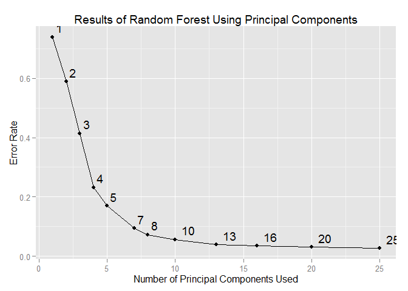

# Can Your Fitbit Tell When You're Slacking?
# Classification of Weightlifting Technique from Personal Activity Trackers
### Grace Pehl, PhD
Objective: Build a machine learning algorithm to predict activity quality from activity monitors

Course project for Practical Machine Learning, part of the Johns Hopkins Data Science Specialization

==========================

#### Data citation:  
Velloso, E.; Bulling, A.; Gellersen, H.; Ugulino, W.; Fuks, H. [Qualitative Activity Recognition of Weight Lifting Exercises](http://groupware.les.inf.puc-rio.br/work.jsf?p1=11201). Proceedings of 4th International Conference in Cooperation with SIGCHI (Augmented Human '13) . Stuttgart, Germany: ACM SIGCHI, 2013.

### Introduction

The dataset consists of 160 features from accelerometers on the arm, forearm, belt, and dumbbell of 6 participants who performed a series of weightlifting exercises both correctly and incorrectly. The subjects performed a set of 10 repetitions of unilateral dumbbell biceps curls in 5 different ways.  The class A set was done with proper technique. The class B set was done throwing the elbows forward; class C, lifting the dumbbell only halfway; class D, lowering the dumbbell only halfway; and class E, throwing the hips forward. 

The complete dataset is split into a training dataset with 13737 observations, a testing dataset with 5885 observations, and a validation set with 20 observations. In the training set, there are no complete cases (observations with no missing values for any feature). Removing 100 features with more than 80% missing values and 7 identification features, leaves 52 features and 13737 out of 13737 complete cases.  The distribution of classes in the training set is: 

 Class   Technique        Counts   Proportion 
 ------  ---------------  -------  -----------
   A       Proper Form      3906     0.28       
   B       Elbows Forward   2658     0.19       
   C       Halfway Up       2396     0.17       
   D       Halfway Down     2252     0.16       
   E       Hips Forward     2525     0.18       

### Principal Component Analysis  
In order to reduce the dimensionality of the dataset (the number of features) and to speed computation time, I perform a principal component analysis on the training set.  The preProcess function will center and scale the features prior to PCA and principal components will be calculated to retain 95% of the variance within the data.

```r
# Perform Principal Component Analysis on the training set
preProc <- preProcess(training[ , -53], method = "pca")
# Apply the transform to all 3 datasets
trainPC <- predict(preProc, training[ , -53])
testPC  <- predict(preProc, testing[ , -53])
validationPC <- predict(preProc, validation[ , -53])
```
PCA reduces the number of features from 52 to 25.  Using the same components, I also transform the testing and validation sets.  

```r
suppressMessages(library(randomForest))
modFit <- rfcv(trainPC, training_labels, step = 0.8, cv.fold = 10)
```
### Estimating Out of Sample Error with Cross Validation  
I use random forest with 10-fold cross validation to select the most important features for the model.  In each fold, I retain the top 80% of features.

 

The cross validation results show that there is very little difference between using all 26 principal components and using only 11.  With 11 features, we would expect an out-of-sample error rate around 5%.  I use the the top 11 principal components (based on mean Gini decrease) to fit a random forest algorithm.

```r
trainPC2 <- trainPC[ , selectedPCs]
trainPC2 <- cbind(trainPC2, 'classe' = training_labels)
modelFit <- randomForest(classe ~ ., data = trainPC2, ntree = 50)
```
The out of sample error can now be estimated using the testing set that has not been used in the model selection or fitting.

```r
# In Sample Error
pred_training <- predict(modelFit, newdata = trainPC)
confusionMatrix(pred_training, training_labels)
```
```
## Confusion Matrix and Statistics
## 
##           Reference
## Prediction    A    B    C    D    E
##          A 3906    0    0    0    0
##          B    0 2658    0    0    0
##          C    0    0 2396    0    0
##          D    0    0    0 2252    0
##          E    0    0    0    0 2525
## 
## Overall Statistics
##                                      
##                Accuracy : 1          
##                  95% CI : (0.9997, 1)
##     No Information Rate : 0.2843     
##     P-Value [Acc > NIR] : < 2.2e-16  
##                                      
##                   Kappa : 1          
##  Mcnemar's Test P-Value : NA         
## 
## Statistics by Class:
## 
##                      Class: A Class: B Class: C Class: D Class: E
## Sensitivity            1.0000   1.0000   1.0000   1.0000   1.0000
## Specificity            1.0000   1.0000   1.0000   1.0000   1.0000
## Pos Pred Value         1.0000   1.0000   1.0000   1.0000   1.0000
## Neg Pred Value         1.0000   1.0000   1.0000   1.0000   1.0000
## Prevalence             0.2843   0.1935   0.1744   0.1639   0.1838
## Detection Rate         0.2843   0.1935   0.1744   0.1639   0.1838
## Detection Prevalence   0.2843   0.1935   0.1744   0.1639   0.1838
## Balanced Accuracy      1.0000   1.0000   1.0000   1.0000   1.0000
```
```r
# Out of Sample Error
pred_testing <- predict(modelFit, newdata = testPC)
confusionMatrix(pred_testing, testing_labels)
```
```
## Confusion Matrix and Statistics
## 
##           Reference
## Prediction    A    B    C    D    E
##          A 1615   34    9   14    4
##          B   14 1052   26    7   15
##          C   23   42  957   62   15
##          D   12    7   27  877    6
##          E   10    4    7    4 1042
## 
## Overall Statistics
##                                           
##                Accuracy : 0.9419          
##                  95% CI : (0.9356, 0.9477)
##     No Information Rate : 0.2845          
##     P-Value [Acc > NIR] : < 2.2e-16       
##                                           
##                   Kappa : 0.9265          
##  Mcnemar's Test P-Value : 2.801e-06       
## 
## Statistics by Class:
## 
##                      Class: A Class: B Class: C Class: D Class: E
## Sensitivity            0.9648   0.9236   0.9327   0.9098   0.9630
## Specificity            0.9855   0.9869   0.9708   0.9894   0.9948
## Pos Pred Value         0.9636   0.9443   0.8708   0.9440   0.9766
## Neg Pred Value         0.9860   0.9818   0.9856   0.9824   0.9917
## Prevalence             0.2845   0.1935   0.1743   0.1638   0.1839
## Detection Rate         0.2744   0.1788   0.1626   0.1490   0.1771
## Detection Prevalence   0.2848   0.1893   0.1867   0.1579   0.1813
## Balanced Accuracy      0.9751   0.9553   0.9518   0.9496   0.9789
```
```r
# Validation set
pred_validation <- predict(modelFit, newdata = validationPC)
answers <- as.character(pred_validation)
```
The out of sample accuracy is 94.7% which gives an error rate very close to our expected error rate of 5%.  Finally, the validation set is run through the model and the predictions will be submitted for validation.

The success of this classification algorithm demonstrates that it is possible to use personal activity monitors to document not only "how much" a person performed an exercise activity, but also "how well" they did it.
