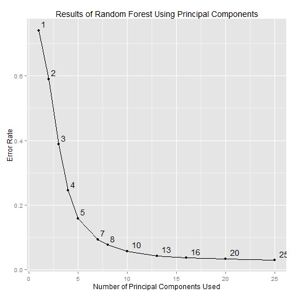

Grace Pehl, Ph.D.
========================================================
author: Customer Data and Analytics Team
date: October 29, 2015

Classification of Weightlifting Technique from Personal Activity Trackers
========================================================

### Objective
Build a machine learning algorithm to predict activity quality from personal activity monitors.

Course project for Practical Machine Learning, part of the Johns Hopkins Data Science Specialization taught by Jeff Leek

#### Data citation:
Velloso, E.; Bulling, A.; Gellersen, H.; Ugulino, W.; Fuks, H. [Qualitative Activity Recognition of Weight Lifting Exercises](http://groupware.les.inf.puc-rio.br/work.jsf?p1=11201). Proceedings of 4th International Conference in Cooperation with SIGCHI (Augmented Human '13) . Stuttgart, Germany: ACM SIGCHI, 2013.

Experimental Setup
========================================================


10 reps unilateral dumbbell biceps curls

******

1. A - Proper technique
2. B - Throwing the elbows forward
3. C - Half lifting the dumbbell
4. D - Half lowering the dumbbell
5. E - Throwing the hips forward

Reading in the Data
========================================================


```r
### download data, if necessary
if (!file.exists(trainingfile)) {
    download.file(trainingURL, trainingfile, mode = "w")
}
if (!file.exists(testingfile)) {
    download.file(testingURL, testingfile, mode = "w")
}
### read in files
df <- read.csv(trainingfile, na.strings = c('NA', '#DIV/0!', ''))
validation <- read.csv(testingfile, na.strings = c('NA', '#DIV/0!', ''))
validation_id <- validation$problem_id
```
160 Features, 19622 Observations

Divide Training Data
=============================================================

```r
suppressMessages(library(caret))
inTrain <- createDataPartition(y = df$classe, p = 0.7, list = FALSE)
training <- df[inTrain, ]
training_labels <- training$classe
testing <- df[-inTrain, ]
testing_labels <- testing$classe
```

Data Cleaning
=========================================================

```r
# remove columns with more than 80% NA values (100 features)
badfeatures <- training[ , colSums(is.na(training)) >= 0.8 * nrow(training)]
validation <- validation[ , colSums(is.na(training)) < 0.8 * nrow(training)]
testing <- testing[ , colSums(is.na(training)) < 0.8 * nrow(training)]
training <- training[ , colSums(is.na(training)) < 0.8 * nrow(training)]
# remove identification columns (7 features)
validation <- validation[ , 8:ncol(training)]
testing <- testing[ , 8:ncol(training)]
training <- training[ , 8:ncol(training)]
```

Distribution of Classes
================================================================


```r
suppressMessages(library(knitr))
kable(class_table)
```


|   |Technique      |Counts |Proportion |
|:--|:--------------|:------|:----------|
|A  |Proper Form    |3906   |0.28       |
|B  |Elbows Forward |2658   |0.19       |
|C  |Halfway Up     |2396   |0.17       |
|D  |Halfway Down   |2252   |0.16       |
|E  |Hips Forward   |2525   |0.18       |

PCA - Retain 95% of Variance
================================================================

```r
# Perform Principal Component Analysis on the training set
preProc <- preProcess(training[ , -53], method = "pca")
# Apply the transform to all 3 datasets
trainPC <- predict(preProc, training[ , -53])
testPC  <- predict(preProc, testing[ , -53])
validationPC <- predict(preProc, validation[ , -53])
```

Feature Selection
=================================================================

```r
# Use Random Forest with cross validation removing 20% of features
suppressMessages(library(randomForest))
modFit <- rfcv(trainPC, training_labels, step = 0.8, cv.fold = 10)
```
 

Identify Top 11 Principal Components
===============================================================

```r
PCtraining <- cbind(trainPC, 'classe' = training_labels)
mod2Fit <- randomForest(classe ~ ., data = PCtraining, ntree = 50,
                        importance = TRUE)
PCimportances <- as.data.frame(importance(mod2Fit))
pred <- predict(mod2Fit, PCtraining)
insample <- sum(pred == PCtraining$classe)/nrow(PCtraining)
# perfect fit to training data
outofsample <- sum(predict(mod2Fit, testPC) == testing_labels)/nrow(testPC)
# out of sample error 96.6%
# select top 11 principal components
PCimportances <- PCimportances[with(PCimportances, order(-MeanDecreaseGini)), ]
selectedPCs <- rownames(PCimportances)[1:11]
```

Train the Algorithm
===============================================================

```r
trainPC2 <- trainPC[ , selectedPCs]
trainPC2 <- cbind(trainPC2, 'classe' = training_labels)
modelFit <- randomForest(classe ~ ., data = trainPC2, ntree = 50)
```

In Sample Error
================================================

```r
# Training Error
pred_training <- predict(modelFit, newdata = trainPC)
confusionMatrix(pred_training, training_labels)
```

```
Confusion Matrix and Statistics

          Reference
Prediction    A    B    C    D    E
         A 3906    0    0    0    0
         B    0 2658    0    0    0
         C    0    0 2396    0    0
         D    0    0    0 2252    0
         E    0    0    0    0 2525

Overall Statistics
                                     
               Accuracy : 1          
                 95% CI : (0.9997, 1)
    No Information Rate : 0.2843     
    P-Value [Acc > NIR] : < 2.2e-16  
                                     
                  Kappa : 1          
 Mcnemar's Test P-Value : NA         

Statistics by Class:

                     Class: A Class: B Class: C Class: D Class: E
Sensitivity            1.0000   1.0000   1.0000   1.0000   1.0000
Specificity            1.0000   1.0000   1.0000   1.0000   1.0000
Pos Pred Value         1.0000   1.0000   1.0000   1.0000   1.0000
Neg Pred Value         1.0000   1.0000   1.0000   1.0000   1.0000
Prevalence             0.2843   0.1935   0.1744   0.1639   0.1838
Detection Rate         0.2843   0.1935   0.1744   0.1639   0.1838
Detection Prevalence   0.2843   0.1935   0.1744   0.1639   0.1838
Balanced Accuracy      1.0000   1.0000   1.0000   1.0000   1.0000
```

Out of Sample Error
==================================================

```r
# Testing Error
pred_testing <- predict(modelFit, newdata = testPC)
confusionMatrix(pred_testing, testing_labels)
```

```
Confusion Matrix and Statistics

          Reference
Prediction    A    B    C    D    E
         A 1625   44    5   10    0
         B   19 1050   31    4   12
         C   21   31  964   46   11
         D    6    6   21  902   11
         E    3    8    5    2 1048

Overall Statistics
                                          
               Accuracy : 0.9497          
                 95% CI : (0.9438, 0.9551)
    No Information Rate : 0.2845          
    P-Value [Acc > NIR] : < 2.2e-16       
                                          
                  Kappa : 0.9364          
 Mcnemar's Test P-Value : 5.453e-06       

Statistics by Class:

                     Class: A Class: B Class: C Class: D Class: E
Sensitivity            0.9707   0.9219   0.9396   0.9357   0.9686
Specificity            0.9860   0.9861   0.9776   0.9911   0.9963
Pos Pred Value         0.9650   0.9409   0.8984   0.9535   0.9831
Neg Pred Value         0.9883   0.9813   0.9871   0.9874   0.9929
Prevalence             0.2845   0.1935   0.1743   0.1638   0.1839
Detection Rate         0.2761   0.1784   0.1638   0.1533   0.1781
Detection Prevalence   0.2862   0.1896   0.1823   0.1607   0.1811
Balanced Accuracy      0.9784   0.9540   0.9586   0.9634   0.9824
```

Closing Slide
============================================
title: false


